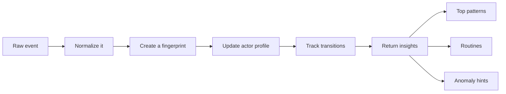

# Behaviour Radar

[](https://opensource.org/licenses/MIT)
[](https://nodejs.org)
[](https://github.com/rogeroliveira84/behaviour-radar)
[](https://nodejs.org/api/test.html)
[](https://github.com/rogeroliveira84/behaviour-radar)
[](https://github.com/rogeroliveira84/behaviour-radar)

🧠 Behaviour Radar is a small JavaScript library that helps you understand repeated actions, user habits, and unusual behaviour from plain event data.

Instead of only storing logs, it gives you a simple behavioural layer on top of them.

With just a few events, you can start answering questions like:

- 🔁 What actions happen again and again?
- 👤 What does this user or device usually do?
- 🛣️ Which flows are becoming routines?
- 🚨 Does this new event look unusual?

No external dependencies. No training pipeline. No setup headache.

## ✨ Why this project is useful

The original idea was great: detect repeated behaviour by hashing events.

This version keeps that simplicity, but makes it much more useful in real projects:

- ✅ Stable event fingerprinting
- ✅ Per-user and per-device profiles
- ✅ Action-to-action routine tracking
- ✅ Simple anomaly scoring with human-readable reasons
- ✅ Configurable scaling limits per instance
- ✅ Optional adapter-based storage design
- ✅ Small API and zero dependencies
- ✅ Tests and example usage included

## 🎯 Great fit for

- Product analytics
- Fraud and risk checks
- Workflow monitoring
- Habit tracking
- Recommendation experiments
- Agents or automations that need behavioural memory

## 📦 Install

```bash
npm install github:rogeroliveira84/behaviour-radar
```

Or clone it locally:

```bash
git clone https://github.com/rogeroliveira84/behaviour-radar.git
cd behaviour-radar
npm test
node examples/quick-start.js
```

## ⚡ Scale it without making it complicated

This version adds bounded-memory controls directly on the tracker instance, so you can keep it fast even with large streams:

- `maxActors`: keep actor profile memory bounded
- `maxPatterns`: keep retained pattern memory bounded
- `actorTtlMs`: expire inactive actor profiles
- `patternTtlMs`: expire old patterns
- `windowMs`: keep only recent retained state

These are global for that `BehaviourRadar` instance, which keeps the mental model simple.

## 🚀 Quick start

```js
const { BehaviourRadar } = require("behaviour-radar");

const radar = new BehaviourRadar({
  actor: (event) => event.userId || event.deviceId || "anonymous"
});

radar.track({
  userId: "user-42",
  action: "LOGIN",
  payload: { method: "password", country: "AU" }
});

radar.track({
  userId: "user-42",
  action: "VIEW_DASHBOARD",
  payload: { section: "portfolio" }
});

radar.track({
  userId: "user-42",
  action: "BUY_ASSET",
  payload: { symbol: "ETH", amount: 2 }
});

console.log(radar.getTopPatterns());
console.log(radar.getActorProfile("user-42"));
console.log(radar.findRoutines("user-42"));
console.log(
  radar.detectAnomaly({
    userId: "user-42",
    action: "TRANSFER_FUNDS",
    payload: { amount: 50000, destination: "new-wallet" }
  })
);
```

## 🏎️ Scalable config example

```js
const { BehaviourRadar } = require("behaviour-radar");

const radar = new BehaviourRadar({
  actor: (event) => event.userId,
  maxActors: 10000,
  maxPatterns: 50000,
  actorTtlMs: 1000 * 60 * 60 * 24,
  patternTtlMs: 1000 * 60 * 60 * 24,
  windowMs: 1000 * 60 * 60 * 24 * 7
});

console.log(radar.getStats());
```

You can also run:

```bash
node examples/scalable-config.js
```

## 🧩 What you get back

### `getTopPatterns()`

Find the most repeated behaviours.

```js
[
  {
    fingerprint: "98b0df32",
    action: "LOGIN",
    count: 3,
    lastSeenAt: "2026-03-20T05:10:00.000Z"
  }
]
```

### `getActorProfile(actorId)`

Get a behavioural summary for one actor:

- total events
- most common actions
- last activity
- recent history
- top transitions

### `findRoutines(actorId)`

Find common flows like:

- `LOGIN -> VIEW_DASHBOARD`
- `VIEW_DASHBOARD -> BUY_ASSET`

### `detectAnomaly(event)`

Check whether an event looks unusual before storing it.

The result includes:

- anomaly score
- severity level
- easy-to-read reasons

Example reasons:

- `new-action-for-actor`
- `new-pattern`
- `new-transition`

## 🛠️ How it works



## 📚 API

### `new BehaviourRadar(options?)`

Create a tracker instance.

Options:

- `actor(event)`: how to identify the actor. Default is `"global"`.
- `normalizer(event)`: transform the event before fingerprinting.
- `sequenceLimit`: number of recent events kept per actor. Default `25`.
- `rarePatternThreshold`: patterns at or below this count are considered rare. Default `1`.
- `maxActors`: maximum retained actor profiles for this instance.
- `maxPatterns`: maximum retained patterns for this instance.
- `actorTtlMs`: remove inactive actor profiles after this time.
- `patternTtlMs`: remove inactive patterns after this time.
- `windowMs`: keep only recent retained state for this instance.
- `adapter`: plug in a storage adapter. By default, Behaviour Radar uses `MemoryAdapter`.

### `track(event)`

Store one event and get a summary back.

Expected shape:

```js
{
  action: "LOGIN",
  payload: { method: "password" },
  timestamp: "2026-03-20T05:10:00.000Z",
  userId: "user-42"
}
```

Only `action` is required.

### `trackMany(events)`

Store many events at once.

### `getTopPatterns(options?)`

Options:

- `limit`: default `5`
- `action`: optional action filter

### `getActorProfile(actorId)`

Returns a full profile for one actor.

### `findRoutines(actorId, options?)`

Options:

- `limit`: default `5`
- `minOccurrences`: default `2`

### `detectAnomaly(event)`

Score an event without storing it.

### `snapshot()`

Get a serializable snapshot of the whole tracker state.

### `getStats()`

Get storage stats for the current instance:

- adapter name
- total ingested events
- retained actors
- retained patterns
- active limits

### `trim(referenceTimestamp?)`

Force retention cleanup manually.

### `MemoryAdapter`

The default adapter is in-memory and optimized for simplicity and speed.

```js
const { BehaviourRadar, MemoryAdapter } = require("behaviour-radar");

const radar = new BehaviourRadar({
  actor: (event) => event.userId,
  adapter: new MemoryAdapter({
    maxActors: 5000,
    maxPatterns: 20000
  })
});
```

### `adapter` contract

If you want to build your own adapter, it needs to expose the same small interface that `BehaviourRadar` uses internally.

At a minimum, your adapter should provide:

```js
class CustomAdapter {
  constructor() {
    this.totalEvents = 0;
    this.actionCounts = new Map();
    this.actorProfiles = new Map();
    this.patterns = new Map();
  }

  prepareFor(timestamp) {
    // Optional cleanup hook called before reads/writes for a given event time.
  }

  incrementTotalEvents() {
    this.totalEvents += 1;
    return this.totalEvents;
  }

  incrementAction(action) {
    const next = (this.actionCounts.get(action) || 0) + 1;
    this.actionCounts.set(action, next);
    return next;
  }

  getActor(actorId) {
    return this.actorProfiles.get(actorId) || null;
  }

  getOrCreateActor(actorId, createProfile) {
    let actor = this.actorProfiles.get(actorId);

    if (!actor) {
      actor = createProfile(actorId);
      this.actorProfiles.set(actorId, actor);
    }

    return actor;
  }

  getPattern(fingerprint) {
    return this.patterns.get(fingerprint) || null;
  }

  recordPattern(prepared) {
    let pattern = this.patterns.get(prepared.fingerprint);

    if (!pattern) {
      pattern = {
        fingerprint: prepared.fingerprint,
        action: prepared.action,
        count: 0,
        firstSeenAt: prepared.timestamp,
        lastSeenAt: prepared.timestamp,
        samplePayload: prepared.payload,
        actors: new Set(),
        lastActorId: prepared.actorId
      };
      this.patterns.set(prepared.fingerprint, pattern);
    }

    pattern.count += 1;
    pattern.lastSeenAt = prepared.timestamp;
    pattern.lastActorId = prepared.actorId;
    pattern.actors.add(prepared.actorId);

    return pattern;
  }

  getTopPatterns(options = {}) {
    const limit = options.limit || 5;
    const action = options.action;

    return Array.from(this.patterns.values())
      .filter((pattern) => !action || pattern.action === action)
      .sort((left, right) => right.count - left.count)
      .slice(0, limit)
      .map((pattern) => ({
        fingerprint: pattern.fingerprint,
        action: pattern.action,
        count: pattern.count,
        actors: pattern.actors.size,
        firstSeenAt: pattern.firstSeenAt,
        lastSeenAt: pattern.lastSeenAt,
        samplePayload: pattern.samplePayload
      }));
  }

  getStats() {
    return {
      adapter: "custom",
      totalEvents: this.totalEvents,
      retainedActors: this.actorProfiles.size,
      retainedPatterns: this.patterns.size,
      limits: {}
    };
  }
}
```

The `prepared` object passed into `recordPattern()` looks like this:

```js
{
  action: "LOGIN",
  payload: { method: "password" },
  actorId: "user-42",
  timestamp: "2026-03-20T05:10:00.000Z",
  fingerprint: "98b0df32"
}
```

The actor profile returned by `getActor()` or `getOrCreateActor()` should look like this:

```js
{
  actorId: "user-42",
  totalEvents: 0,
  firstSeenAt: null,
  lastSeenAt: null,
  lastAction: null,
  actionCounts: new Map(),
  transitions: new Map(),
  history: []
}
```

Notes:

- `actionCounts`, `actorProfiles`, and `patterns` are read by `snapshot()`, so they should be present on the adapter.
- `actors` inside a pattern is expected to behave like a `Set`.
- `history` is expected to be an array of `{ timestamp, action, fingerprint }`.
- If you use Redis, SQLite, or another external store, the easiest approach is often to keep this same contract and adapt persistence behind it.

## 🧼 Custom normalization

If you want to ignore noisy fields like request ids or timestamps, use a custom normalizer:

```js
const radar = new BehaviourRadar({
  actor: (event) => event.userId,
  normalizer: (event) => ({
    action: event.action,
    payload: {
      ...event.payload,
      requestId: undefined,
      timestamp: undefined
    }
  })
});
```

## 💡 Real example

Imagine an investment app where `user-42` often does this:

1. `LOGIN`
2. `VIEW_DASHBOARD`
3. `BUY_ASSET`

After this repeats a few times, Behaviour Radar learns that this flow is familiar.

If the next event becomes `TRANSFER_FUNDS` to a new destination, the library can flag it as unusual because:

- 🚨 it is a new action for that actor
- 🚨 it creates a new pattern
- 🚨 it breaks the usual transition flow

## 🧪 Run locally

Run the example:

```bash
node examples/quick-start.js
```

Run the tests:

```bash
npm test
```

## 🗺️ Roadmap ideas

- Redis adapter
- SQLite adapter
- Session detection
- Recency weighting
- Actor segmentation
- Live streaming ingestion

## 📄 License

MIT

## 👤 Author

Created by Roger Oliveira.
