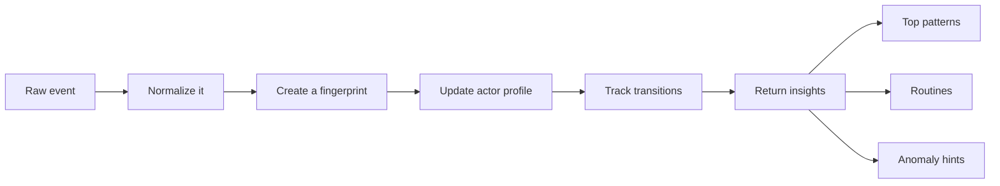

# Behaviour Radar

[](https://opensource.org/licenses/MIT)
[](https://nodejs.org)
[](https://github.com/rogeroliveira84/behaviour-ai)
[](https://nodejs.org/api/test.html)
[](https://github.com/rogeroliveira84/behaviour-ai)
[](https://github.com/rogeroliveira84/behaviour-ai)

🧠 Behaviour Radar is a small JavaScript library that helps you understand repeated actions, user habits, and unusual behaviour from plain event data.

Instead of only storing logs, it gives you a simple behavioural layer on top of them.

With just a few events, you can start answering questions like:

- 🔁 What actions happen again and again?
- 👤 What does this user or device usually do?
- 🛣️ Which flows are becoming routines?
- 🚨 Does this new event look unusual?

No external dependencies. No training pipeline. No setup headache.

## ✨ Why this project is useful

The original idea was great: detect repeated behaviour by hashing events.

This version keeps that simplicity, but makes it much more useful in real projects:

- ✅ Stable event fingerprinting
- ✅ Per-user and per-device profiles
- ✅ Action-to-action routine tracking
- ✅ Simple anomaly scoring with human-readable reasons
- ✅ Small API and zero dependencies
- ✅ Tests and example usage included

## 🎯 Great fit for

- Product analytics
- Fraud and risk checks
- Workflow monitoring
- Habit tracking
- Recommendation experiments
- Agents or automations that need behavioural memory

## 📦 Install

```bash
npm install github:rogeroliveira84/behaviour-ai
```

Or clone it locally:

```bash
git clone https://github.com/rogeroliveira84/behaviour-ai.git
cd behaviour-ai
npm test
node examples/quick-start.js
```

## 🚀 Quick start

```js
const { BehaviourRadar } = require("behaviour-ai");

const radar = new BehaviourRadar({
  actor: (event) => event.userId || event.deviceId || "anonymous"
});

radar.track({
  userId: "user-42",
  action: "LOGIN",
  payload: { method: "password", country: "AU" }
});

radar.track({
  userId: "user-42",
  action: "VIEW_DASHBOARD",
  payload: { section: "portfolio" }
});

radar.track({
  userId: "user-42",
  action: "BUY_ASSET",
  payload: { symbol: "ETH", amount: 2 }
});

console.log(radar.getTopPatterns());
console.log(radar.getActorProfile("user-42"));
console.log(radar.findRoutines("user-42"));
console.log(
  radar.detectAnomaly({
    userId: "user-42",
    action: "TRANSFER_FUNDS",
    payload: { amount: 50000, destination: "new-wallet" }
  })
);
```

## 🧩 What you get back

### `getTopPatterns()`

Find the most repeated behaviours.

```js
[
  {
    fingerprint: "98b0df32",
    action: "LOGIN",
    count: 3,
    lastSeenAt: "2026-03-20T05:10:00.000Z"
  }
]
```

### `getActorProfile(actorId)`

Get a behavioural summary for one actor:

- total events
- most common actions
- last activity
- recent history
- top transitions

### `findRoutines(actorId)`

Find common flows like:

- `LOGIN -> VIEW_DASHBOARD`
- `VIEW_DASHBOARD -> BUY_ASSET`

### `detectAnomaly(event)`

Check whether an event looks unusual before storing it.

The result includes:

- anomaly score
- severity level
- easy-to-read reasons

Example reasons:

- `new-action-for-actor`
- `new-pattern`
- `new-transition`

## 🛠️ How it works



## 📚 API

### `new BehaviourRadar(options?)`

Create a tracker instance.

Options:

- `actor(event)`: how to identify the actor. Default is `"global"`.
- `normalizer(event)`: transform the event before fingerprinting.
- `sequenceLimit`: number of recent events kept per actor. Default `25`.
- `rarePatternThreshold`: patterns at or below this count are considered rare. Default `1`.

### `track(event)`

Store one event and get a summary back.

Expected shape:

```js
{
  action: "LOGIN",
  payload: { method: "password" },
  timestamp: "2026-03-20T05:10:00.000Z",
  userId: "user-42"
}
```

Only `action` is required.

### `trackMany(events)`

Store many events at once.

### `getTopPatterns(options?)`

Options:

- `limit`: default `5`
- `action`: optional action filter

### `getActorProfile(actorId)`

Returns a full profile for one actor.

### `findRoutines(actorId, options?)`

Options:

- `limit`: default `5`
- `minOccurrences`: default `2`

### `detectAnomaly(event)`

Score an event without storing it.

### `snapshot()`

Get a serializable snapshot of the whole tracker state.

## 🧼 Custom normalization

If you want to ignore noisy fields like request ids or timestamps, use a custom normalizer:

```js
const radar = new BehaviourRadar({
  actor: (event) => event.userId,
  normalizer: (event) => ({
    action: event.action,
    payload: {
      ...event.payload,
      requestId: undefined,
      timestamp: undefined
    }
  })
});
```

## 💡 Real example

Imagine an investment app where `user-42` often does this:

1. `LOGIN`
2. `VIEW_DASHBOARD`
3. `BUY_ASSET`

After this repeats a few times, Behaviour Radar learns that this flow is familiar.

If the next event becomes `TRANSFER_FUNDS` to a new destination, the library can flag it as unusual because:

- 🚨 it is a new action for that actor
- 🚨 it creates a new pattern
- 🚨 it breaks the usual transition flow

## 🧪 Run locally

Run the example:

```bash
node examples/quick-start.js
```

Run the tests:

```bash
npm test
```

## 🗺️ Roadmap ideas

- Time windows and recency weighting
- Session detection
- Persistence adapters for Redis, SQLite, or Postgres
- Actor segmentation
- Live streaming ingestion

## 📄 License

MIT
